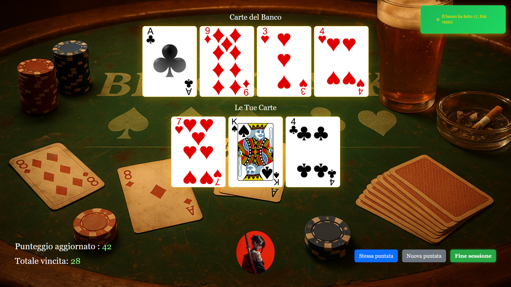
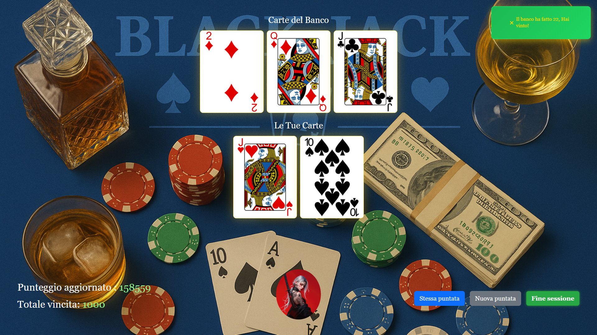
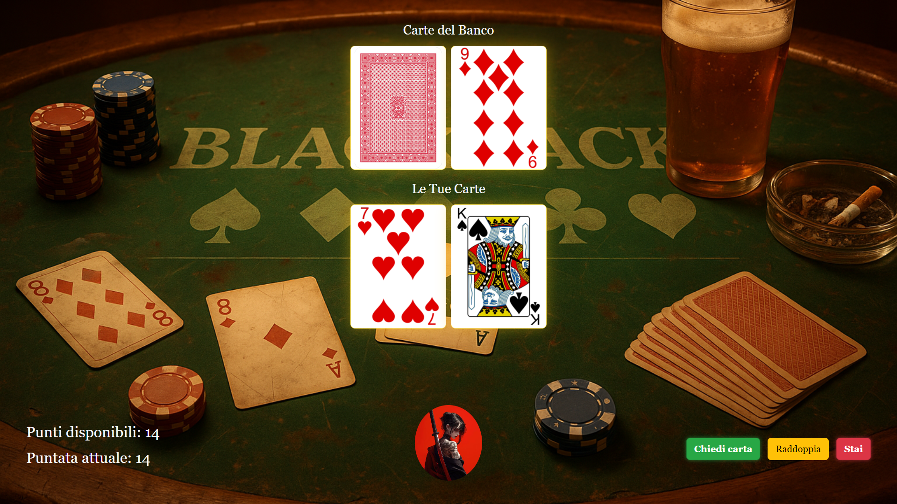
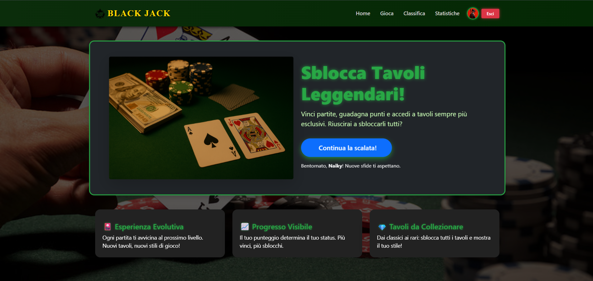
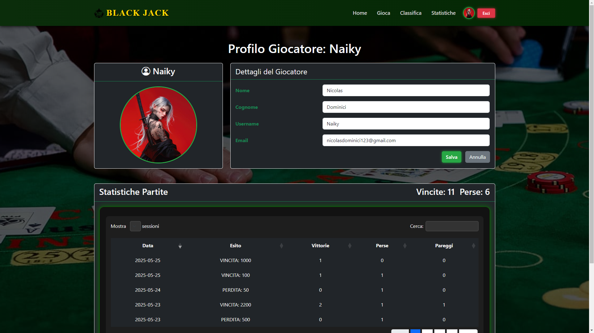

# 🃏 Jack Masters

Welcome to the **Black Jack Web Game** repository, a web platform where users can register, log into their account, and play Black Jack with a progression system based on gameplay performance.  
Each player can improve their profile, climb through tables with increasing difficulty, view statistics, and compete on leaderboards.

---

## ✨ Main Features

- 👤 User Registration and Login
- 🔐 Session management via PHP and MySQL
- 🎮 Interactive Black Jack game (client-side)
- 📈 Progression system with progressively harder tables
- 🏆 Online player leaderboards
- 📊 Personal statistics (win rate, points, match history)
- 💾 Persistent storage of results and progress in the database

---

## 🧱 Technology Stack

| Technology | Role |
|---|---|
| HTML5 | Page structure |
| CSS3 | Styles and layout |
| Bootstrap | Responsive UI |
| JavaScript | Client-side game logic |
| PHP | Server logic, authentication |
| MySQL | User data and statistics management |
| XAMPP | Local server (Apache + MySQL) |
| phpMyAdmin | Database management interface |

---

## 🏗 System Architecture

The application uses a **client-server** architecture with persistent storage through a database:

- **Client**: HTML, CSS, JS, Bootstrap
- **Server**: PHP
- **Database**: MySQL for users, matches, and leaderboards

---

## 🕹 Game System and Progression

The progression system rewards player performance:

- Earn points by winning or completing matches
- Higher points unlock access to more advanced **tables**
- Each table may feature:
  - Different difficulty
  - Different scoring
  - Separate leaderboards
---

## 📊 Statistics and Leaderboards

Players can view:

- Total matches played
- Total points
- Win rate
- Current table
- Match history

Leaderboards display top players based on:

- Total points
- Current table
- Optional additional metrics

---

## 🖥 Setup & Installation

### ✔ Requirements

- XAMPP or equivalent environment (Apache + PHP + MySQL)
- Modern browser

### 🚀 Installation

1. Copy or clone the project into the `htdocs/` directory of XAMPP
2. Start **Apache** and **MySQL** from the XAMPP Control Panel
3. Open `phpMyAdmin` and create the database
4. Import any provided `.sql` file
5. Configure credentials in the PHP configuration file (e.g. `php/database_management.php`)
6. Visit:  
   `http://localhost/project-name/`

---

## 🖼 Images / Screenshots

  
  
  
  

---
