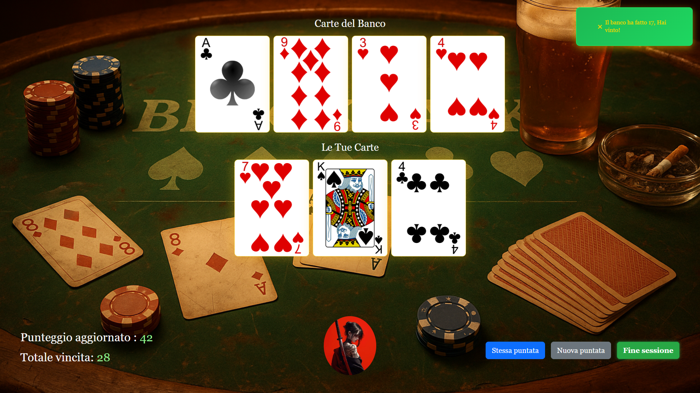
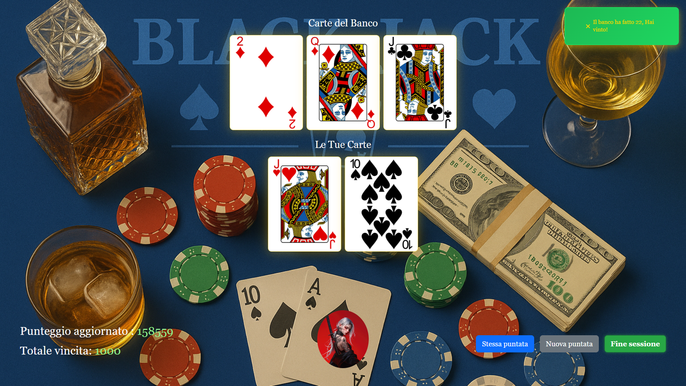
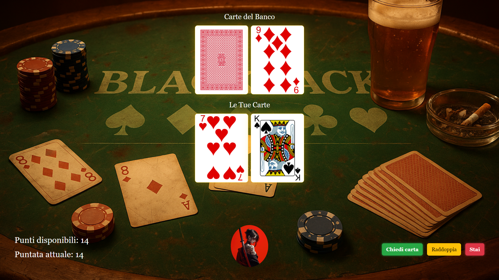
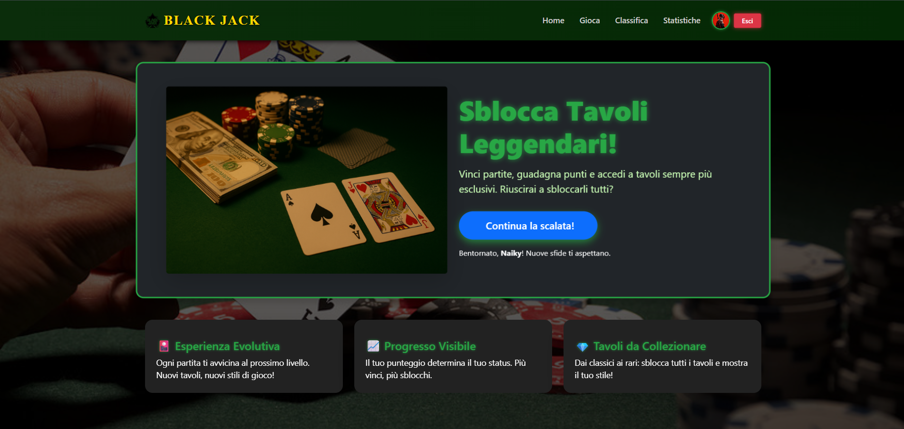
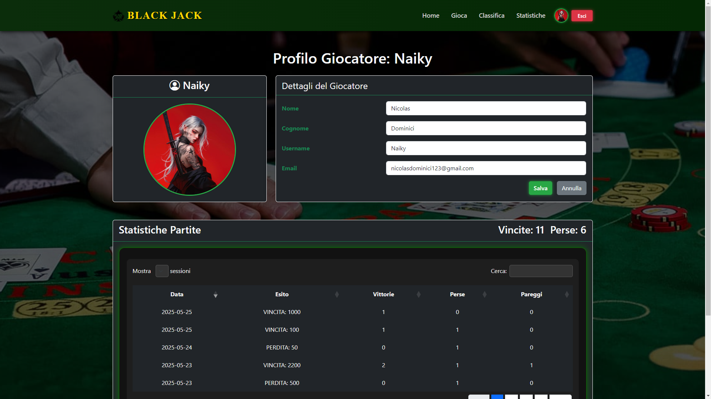

# 🃏 Jack Masters

Welcome to the **Black Jack Web Game** repository, a web platform where users can register, log into their account, and play Black Jack with a progression system based on gameplay performance.  
Each player can improve their profile, climb through tables with increasing difficulty, view statistics, and compete on leaderboards.

---

## ✨ Main Features

- 👤 User Registration and Login
- 🔐 Session management via PHP and MySQL
- 🎮 Interactive Black Jack game (client-side)
- 📈 Progression system with progressively harder tables
- 🏆 Online player leaderboards
- 📊 Personal statistics (win rate, points, match history)
- 💾 Persistent storage of results and progress in the database

---

## 🧱 Technology Stack

| Technology | Role |
|---|---|
| HTML5 | Page structure |
| CSS3 | Styles and layout |
| Bootstrap | Responsive UI |
| JavaScript | Client-side game logic |
| PHP | Server logic, authentication |
| MySQL | User data and statistics management |
| XAMPP | Local server (Apache + MySQL) |
| phpMyAdmin | Database management interface |

---

## 🏗 System Architecture

The application uses a **client-server** architecture with persistent storage through a database:

- **Client**: HTML, CSS, JS, Bootstrap
- **Server**: PHP
- **Database**: MySQL for users, matches, and leaderboards

---

## 🕹 Game System and Progression

The progression system rewards player performance:

- Earn points by winning or completing matches
- Higher points unlock access to more advanced **tables**
- Each table may feature:
  - Different difficulty
  - Different scoring
  - Separate leaderboards
---

## 📊 Statistics and Leaderboards

Players can view:

- Total matches played
- Total points
- Win rate
- Current table
- Match history

Leaderboards display top players based on:

- Total points
- Current table
- Optional additional metrics

---

## 🖥 Setup & Installation

### ✔ Requirements

- XAMPP or equivalent environment (Apache + PHP + MySQL)
- Modern browser

### 🚀 Installation

1. Copy or clone the project into the `htdocs/` directory of XAMPP
2. Start **Apache** and **MySQL** from the XAMPP Control Panel
3. Open `phpMyAdmin` and create the database
4. Import any provided `.sql` file
5. Configure credentials in the PHP configuration file (e.g. `php/database_management.php`)
6. Visit:  
   `http://localhost/project-name/`

---

## 🖼 Images / Screenshots

  
  
  
  


---

## 🆕 MEAN Multiplayer Edition

The project now includes a modern MEAN-stack layer for multiplayer gameplay with real-time matchmaking and Socket.IO.

### 🗂 New Structure

```
Jack-Masters/
├── backend/      Node.js + Express + Socket.IO + Mongoose (TypeScript)
├── frontend/     Angular standalone app
└── ... (existing PHP app unchanged)
```

### 🚀 Running the Backend

```bash
cd backend
npm install
cp .env.example .env   # edit as needed
npm run dev            # starts dev server on http://localhost:3000
```

**Environment variables** (see `backend/.env.example`):

| Variable        | Default                 | Description                        |
|-----------------|-------------------------|------------------------------------|
| `PORT`          | `3000`                  | HTTP port                          |
| `MONGODB_URI`   | *(unset)*               | Optional MongoDB connection string |
| `CORS_ORIGIN`   | `http://localhost:4200` | Allowed frontend origin            |

> **MongoDB is optional.** If `MONGODB_URI` is not set or connection fails, the backend runs in-memory (completed matches are not persisted).

#### REST API

| Method | Path                       | Description                       |
|--------|----------------------------|-----------------------------------|
| GET    | `/api/health`              | Health check                      |
| POST   | `/api/auth/guest`          | Create guest session → `{token}`  |
| POST   | `/api/matchmaking/enqueue` | Signal intent to queue (REST)     |

Real matchmaking uses **Socket.IO events** (see `backend/src/socket/index.ts`).

### 🚀 Running the Frontend

```bash
cd frontend
npm install
npm start   # Angular dev server on http://localhost:4200
```

### 🧪 Backend Tests

```bash
cd backend
npm run build && npm test
```

---
