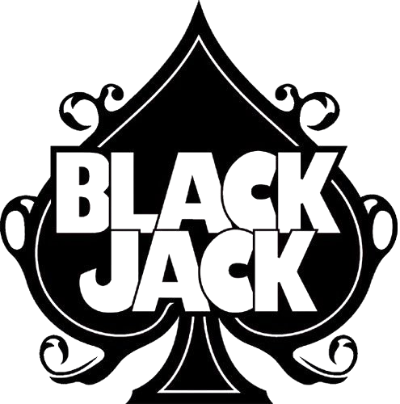

<div align="center">



# 🃏 Jack Masters

### Web-based Black Jack with progression system, leaderboards & persistent stats

[](https://jackmastes.nicolas-dominici.it)
[](https://github.com/Na1ky/Jack-Masters)


</div>

---

## 📖 Overview

Jack Masters è una **piattaforma web di Black Jack** con account, progressione e classifiche online. Gli utenti si registrano, giocano, guadagnano punti e sbloccano tavoli sempre più esclusivi — dal verde al dorato. Ogni partita contribuisce allo storico personale e alla classifica globale.

L'architettura è **client-server** classica: il client gestisce la logica di gioco in JavaScript puro, il backend PHP si occupa di autenticazione e persistenza su MySQL.

---

## ✨ Funzionalità Principali

| | Feature | Descrizione |
|---|---|---|
| 👤 | **Auth completa** | Registrazione, login e gestione sessioni via PHP + MySQL |
| 🎮 | **Black Jack interattivo** | Logica di gioco completa lato client (hit, stand, bust, blackjack) |
| 📈 | **Sistema di progressione** | Punti accumulati partita dopo partita sbloccano tavoli più avanzati |
| 🏆 | **Classifiche online** | Leaderboard globale con punti totali, table corrente e win rate |
| 📊 | **Statistiche personali** | Partite giocate, punti totali, percentuale vittorie, storico match |
| 💾 | **Persistenza totale** | Tutti i risultati salvati su database, profilo sempre aggiornato |

---

## 🖼️ Preview

| Home | Gameplay | Statistiche |
|:---:|:---:|:---:|
|  |  |  |

<details>
<summary>📸 Mostra altri screenshot</summary>
<br>


</details>

---

## 🧱 Stack Tecnologico

| Layer | Tecnologia | Ruolo |
|---|---|---|
| Frontend | HTML5, CSS3, Bootstrap | Struttura, stili e layout responsive |
| Frontend | JavaScript (vanilla) | Logica di gioco client-side |
| Backend | PHP | Autenticazione, sessioni, API REST |
| Database | MySQL | Utenti, partite, classifiche |
| Dev | XAMPP | Server locale (Apache + MySQL) |
| Deploy | Docker + Docker Compose | Container per sviluppo e produzione |

---

## 🏗️ Architettura

```
Client (HTML + CSS + JS)
    │
    ├── Logica di gioco (JavaScript)
    │       └── Hit, Stand, Bust, Blackjack, Punteggio
    │
    └── API calls (Fetch / XHR)
            │
            ▼
    Backend (PHP + Apache)
            │
            ├── Auth & Sessions
            ├── Game results → MySQL
            └── Leaderboard & Stats
```

---

## 🚀 Installazione

### Opzione A — XAMPP (locale)

**Requisiti:** XAMPP (Apache + PHP + MySQL) e un browser moderno.

```bash
# 1. Clona il repository nella cartella htdocs di XAMPP
git clone https://github.com/Na1ky/Jack-Masters.git
cd Jack-Masters

# 2. Avvia Apache e MySQL dal pannello XAMPP

# 3. Importa il database
#    Apri phpMyAdmin → crea database → importa db/blackjack_db.sql

# 4. Apri nel browser
#    http://localhost/Jack-Masters/
```

### Opzione B — Docker 🐳

**Requisiti:** [Docker](https://docs.docker.com/get-docker/) e [Docker Compose](https://docs.docker.com/compose/install/)

```bash
# 1. Clona il repository
git clone https://github.com/Na1ky/Jack-Masters.git
cd Jack-Masters

# 2. Avvia app + database
docker compose up --build

# 3. Apri nel browser
#    http://localhost:8080
```

Il `docker-compose.yml` avvia automaticamente:
- Immagine PHP 8.2 + Apache
- Container MariaDB 10.11
- Import automatico di `db/blackjack_db.sql` al primo avvio
- Mount della cartella sorgente per live-editing

```bash
# Stop
docker compose down          # mantiene il volume del database
docker compose down -v       # elimina anche il volume
```

---

## 🔑 Variabili d'Ambiente

Il database viene configurato tramite variabili d'ambiente (fallback sulle credenziali XAMPP di default):

| Variabile | Default | Descrizione |
|---|---|---|
| `DB_HOST` | `127.0.0.1` | Host MySQL/MariaDB |
| `DB_PORT` | `3306` | Porta MySQL |
| `DB_USER` | `root` | Username database |
| `DB_PASS` | *(vuota)* | Password database |
| `DB_NAME` | `blackjack` | Nome del database |

Copia `.env.example` in `.env` e personalizza i valori. Non committare mai il file `.env`.

---

## ☁️ Deploy

<details>
<summary>InfinityFree (hosting gratuito PHP + MySQL)</summary>

1. Registrati su [infinityfree.com](https://infinityfree.com)
2. Crea un sito e nota host, user, password e nome del database
3. Carica il progetto via FTP o File Manager
4. Crea `.env` con le credenziali InfinityFree
5. Importa `db/blackjack_db.sql` via phpMyAdmin del pannello
6. Accedi a `https://your-domain.infinityfree.com`

</details>

<details>
<summary>Render (24/7, Docker-based)</summary>

1. Fork/push del repository su GitHub
2. Vai su [render.com](https://render.com) → New → Web Service
3. Connetti il repository GitHub
4. Render rileva `render.yaml` automaticamente
5. Aggiungi le variabili d'ambiente nel pannello Render
6. Click Deploy → live su `https://<service>.onrender.com` 🎉

> Il tier gratuito va in sleep dopo ~15 minuti di inattività.

Per il database usa un provider esterno compatibile con MySQL: [PlanetScale](https://planetscale.com), [Aiven](https://aiven.io) o [Railway](https://railway.app).

</details>

---

## 🎮 Sistema di Progressione

I tavoli si sbloccano accumulando punti:

```
🟢 Tavolo Verde    →  punti base     (partenza)
🔵 Tavolo Blu      →  punti medi     (sblocca dopo alcune vittorie)
🟣 Tavolo Viola    →  punti avanzati (richiede costanza)
🟡 Tavolo Dorato   →  punteggio top  (il più esclusivo)
```

Ogni tavolo ha difficoltà, scoring e classifiche separate.

---

## 💾 Note sulla Persistenza

| Elemento | Dettaglio |
|---|---|
| **Database** | Tutti i dati utente, partite e classifiche su MySQL. Usa un DB esterno in produzione. |
| **Avatar** | Salvati come URL (es. Imgur) — nessun upload server-side. |
| **Sessioni PHP** | Salvate nel filesystem del container. Si resettano al riavvio: usa Redis per deploy multi-replica. |
| **Asset statici** | CSS, JS e immagini inclusi nell'immagine Docker — nessun volume necessario. |

---

## 👤 Autore

**Nicolas Dominici** — [nicolas-dominici.it](https://nicolas-dominici.it) · [GitHub @Na1ky](https://github.com/Na1ky)
